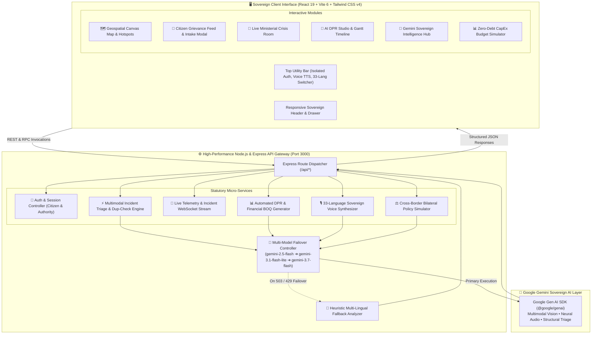

# 🌐 PulseGov — BRICS Sovereign DPI & Gemini Intelligence Hub

[](https://www.typescriptlang.org/)
[](https://react.dev/)
[](https://vitejs.dev/)
[](https://tailwindcss.com/)
[](https://ai.google.dev/)
[](LICENSE)

> **PulseGov** is an open-source, sovereign **Digital Public Infrastructure (DPI)** and AI-augmented **Citizen Grievance Triage Dashboard** engineered to meet the statutory, multi-jurisdictional, and cross-lingual requirements of **BRICS+ & UAE alliance nations** (India, China, Russia, Brazil, South Africa, Egypt, Ethiopia, Iran, United Arab Emirates, and Saudi Arabia).

---

## 📑 Table of Contents

- [🏛️ Project Vision & Overview](#-project-vision--overview)
- [🏗️ System Architecture (Mermaid.js)](#️-system-architecture-mermaidjs)
- [⚡ Key Features & Capabilities](#-key-features--capabilities)
- [🛠️ Comprehensive Tech Stack](#️-comprehensive-tech-stack)
- [🌍 33-Language Sovereign i18n Matrix](#-33-language-sovereign-i18n-matrix)
- [📁 Project Structure](#-project-structure)
- [🚀 Getting Started & Local Setup](#-getting-started--local-setup)
- [⚙️ Environment Variables](#️-environment-variables)
- [🛡️ Security & Sovereign Data Protection](#️-security--sovereign-data-protection)
- [📜 License](#-license)

---

## 🏛️ Project Vision & Overview

Traditional citizen grievance portals often suffer from multi-dialect language barriers, siloed departmental bureaucracy, duplicate complaint flooding, and delayed infrastructure resource allocation.

**PulseGov** reimagines digital governance through sovereign digital architecture:
- **Zero-Language Exclusion:** Real-time bi-directional translation and speech synthesis across 33 native BRICS+ dialects.
- **Multimodal AI Intake:** Ingest citizen voice notes, camera captures, and geo-coordinates, automatically identifying infrastructure failures (potholes, pipeline bursts, grid blackouts, structural damage).
- **ISO-37120 Demand Hotspot Matrix:** Dynamic spatial clustering that calculates infrastructure urgency scores, impact populations, and CapEx forecasts.
- **Automated AI DPR Studio:** Instant generation of bankable **Detailed Project Reports (DPRs)** complete with milestone Gantt schedules, bill-of-quantities (BOQ), and NDB (New Development Bank) funding alignment.
- **Statutory Sovereign UI:** Designed to adhere strictly to international public-sector web standards, featuring an isolated top utility bar, accessibility options, and zero-viewport clipping.

---

## 🏗️ System Architecture (Mermaid.js)

The following diagram illustrates the unidirectional data flow, dual-mode Gemini execution failover, and full-stack orchestration between client, backend server, geospatial engine, and AI model layer:



---

## ⚡ Key Features & Capabilities

### 1. 🏛️ Isolated Government Utility Bar & Authentication
- **Public Sector Standards Compliance:** Login, Sign Up, Profile Console, and Emergency status are housed in a dedicated **Top Utility Bar** above the main navigation header.
- **Role-Based Access Control (RBAC):** Distinct permissions and workflows for authenticated **Civil Authorities** (Engineers, Municipal Commissioners) versus **Citizens**.

### 2. 🌍 Universal 33-Language i18n & Neural Voice Synthesizer
- **Complete Native Translations:** Instant client-side locale toggling across 33 global and BRICS national/regional languages.
- **Gemini Audio Assistant:** In-browser and server-synthesized speech delivery for accessible, hands-free citizen briefings.

### 3. 🚨 Multimodal Vision Triage & Smart Duplicate Prevention
- **Automated Image Diagnostics:** Analyzes submitted photos to determine severity (Critical, High, Medium, Low), estimate affected population, and assign relevant municipal departments.
- **Duplicate Detection Filter:** Prevents civic ticket spam by geo-fencing proximate reports and clustering duplicate community complaints.

### 4. 🗺️ High-Resolution Geospatial Hotspot Canvas
- **Interactive Spatial Map:** Vector-based canvas rendering demand clusters, emergency triage points, and status filters across all 10 BRICS member countries.
- **ISO-37120 Metric Integration:** Calculates city resilience and sustainable municipal metrics.

### 5. 📄 AI DPR Studio & Gantt Timeline Generator
- **Instant Engineering DPRs:** Synthesizes comprehensive infrastructure proposals with project descriptions, regulatory clearances, risks, and bills of quantities.
- **Interactive Gantt Chart:** Visualizes project execution phases from procurement to commissioning.

### 6. 📱 100% Fluid Mobile & Tablet Responsiveness
- **Adaptive Breakpoints:** Smooth transitions between desktop horizontal navigation, tablet quick-pills, and an accessible mobile slide-down drawer.
- **Zero Horizontal Overflow:** Guaranteed 100% viewport width coverage with robust overflow bounds.

---

## 🛠️ Comprehensive Tech Stack

### Frontend Ecosystem
| Technology | Version | Purpose |
| :--- | :--- | :--- |
| **React** | `^19.0.1` | Declarative component UI engine with modern hooks architecture |
| **Vite** | `^6.2.3` | High-speed frontend build tool and dev server |
| **TypeScript** | `~5.8.2` | End-to-end static type safety and contract enforcement |
| **Tailwind CSS** | `^4.1.14` | Modern utility-first CSS styling engine |
| **@tailwindcss/vite** | `^4.1.14` | First-party Vite integration for Tailwind CSS v4 |
| **Motion** | `^12.23.24` | Hardware-accelerated UI layout animations and gesture transitions |
| **Lucide React** | `^0.546.0` | High-contrast, clean vector icons for public sector interfaces |
| **React Markdown** | `^10.1.0` | Secure rendering for AI-generated reports and documentation |

### Backend & Middleware
| Technology | Version | Purpose |
| :--- | :--- | :--- |
| **Express** | `^4.21.2` | RESTful API routing, SSR asset serving, and microservice proxying |
| **Node.js** | `>=20.x` | Server-side runtime environment |
| **tsx** | `^4.21.0` | Zero-config TypeScript runtime execution for local development |
| **esbuild** | `^0.25.0` | Ultra-fast Node.js server bundler producing self-contained `dist/server.cjs` |
| **dotenv** | `^17.2.3` | Multi-environment configuration manager |

### Artificial Intelligence & Cognitive Layer
| Technology | Version | Purpose |
| :--- | :--- | :--- |
| **@google/genai** | `^2.4.0` | Official Google Gen AI SDK for Gemini models |
| **Gemini 2.5 / 3.7 Flash** | Cloud API | Multimodal vision triage, 33-language reasoning, and DPR synthesis |
| **Multi-Model Retry Engine** | Internal | Resilient fallback mechanism handling 429/503 limits across secondary models |

---

## 🌍 33-Language Sovereign i18n Matrix

PulseGov features native support for all BRICS+ member territories and global diplomatic languages:

| ISO Code | Language Name | Native Script | Territory Focus |
| :--- | :--- | :--- | :--- |
| `en` | English | English | International / BRICS Secretariat |
| `hi` | Hindi | हिन्दी | Republic of India |
| `zh` | Mandarin Chinese | 简体中文 | People's Republic of China |
| `ru` | Russian | Русский | Russian Federation |
| `pt` | Portuguese (BR) | Português | Federative Republic of Brazil |
| `ar` | Arabic | العربية | UAE, Saudi Arabia, Egypt |
| `es` | Spanish | Español | Latin American Regional Partners |
| `bn` | Bengali | বাংলা | South Asia Regional Corridor |
| `ta` | Tamil | தமிழ் | Southern India & Diaspora |
| `te` | Telugu | తెలుగు | Southern India |
| `mr` | Marathi | मराठी | Western India |
| `gu` | Gujarati | ગુજરાતી | Western India |
| `kn` | Kannada | ಕನ್ನಡ | Southern India |
| `ml` | Malayalam | മലയാളം | Southern India |
| `pa` | Punjabi | ਪੰਜਾਬੀ | Northern India |
| `ur` | Urdu | اردو | South Asia / Middle East |
| `am` | Amharic | አማርኛ | Federal Democratic Republic of Ethiopia |
| `fa` | Persian (Farsi) | فارسی | Islamic Republic of Iran |
| `af` | Afrikaans | Afrikaans | Republic of South Africa |
| `zu` | isiZulu | isiZulu | Republic of South Africa |
| `xh` | isiXhosa | isiXhosa | Republic of South Africa |
| `st` | Sesotho | Sesotho | Republic of South Africa |
| `sw` | Swahili | Kiswahili | East African Community |
| `id` | Indonesian | Bahasa Indonesia | ASEAN Strategic Partner |
| `vi` | Vietnamese | Tiếng Việt | Southeast Asia Partner |
| `th` | Thai | ไทย | Southeast Asia Partner |
| `ms` | Malay | Bahasa Melayu | Southeast Asia Partner |
| `tr` | Turkish | Türkçe | West Asia / Eurasia |
| `fr` | French | Français | Global Diplomatic Standard |
| `de` | German | Deutsch | European Trade Corridor |
| `ja` | Japanese | 日本語 | East Asia Partner |
| `ko` | Korean | 한국어 | East Asia Partner |
| `it` | Italian | Italiano | Mediterranean Maritime Corridor |

---

## 📁 Project Structure

```text
├── .env.example                 # Example environment variables definition
├── index.html                   # HTML5 Entry Point with high-contrast reset
├── metadata.json                # AI Studio Application metadata & permissions
├── package.json                 # Project dependencies, scripts & configuration
├── server.ts                    # Full-Stack Express API server & Gemini Gateway
├── tsconfig.json                # TypeScript compiler configuration
├── tsconfig.node.json           # TypeScript configuration for Node environment
├── vite.config.ts               # Vite configuration with Tailwind CSS plugin
├── public/                      # Static public assets and emblems
└── src/
    ├── main.tsx                 # Client React entry point
    ├── App.tsx                  # Root Application Component & View Router
    ├── index.css                # Global Tailwind CSS imports and utility rules
    ├── types.ts                 # Global TypeScript definitions & data contracts
    ├── context/
    │   ├── AuthContext.tsx      # Sovereign Authentication & RBAC Context
    │   └── LanguageContext.tsx  # 33-Language i18n & Voice Synthesizer Context
    ├── data/
    │   └── bricsHotspots.ts     # Seed telemetry & GIS hotspot demand dataset
    └── components/
        ├── Navbar.tsx           # Sovereign Navigation Header & Utility Bar
        ├── LanguageSelector.tsx # 33-Language searchable selection modal/dropdown
        ├── LiveEmergencyTicker.tsx # Real-time emergency alert broadcast ticker
        ├── SovereignBRICSFooter.tsx # Statutory BRICS+ diplomatic footer
        ├── GeospatialHotspotMap.tsx # High-resolution GIS demand map canvas
        ├── GeospatialMapCanvas.tsx  # Optimized vector coordinate canvas
        ├── HotspotsView.tsx     # ISO-37120 Hotspots prioritization matrix
        ├── CitizenPortalView.tsx# Citizen grievance feed & tracking
        ├── CitizenComplaintPage.tsx # Statutory complaint submission page
        ├── CitizenIntakeModal.tsx   # Fast modal for citizen grievance filing
        ├── CrisisDashboardView.tsx  # Live ministerial emergency crisis room
        ├── DPRStudioView.tsx    # Automated DPR generation & Gantt timeline
        ├── PolicyCopilotView.tsx# Gemini Sovereign Intelligence Hub
        └── BudgetSimulatorModal.tsx # Zero-Debt CapEx financial simulator
```

---

## 🚀 Getting Started & Local Setup

Follow these steps to configure and launch PulseGov on your local workstation.

### Prerequisites
- **Node.js**: Version `20.x` or higher installed
- **npm** (or `pnpm` / `yarn`): Node package manager
- **Gemini API Key**: (Optional for local AI features; the platform includes smart heuristic fallbacks if unprovided)

### 1. Clone the Repository
```bash
git clone https://github.com/your-username/pulsegov-sovereign-dpi.git
cd pulsegov-sovereign-dpi
```

### 2. Install Dependencies
```bash
npm install
```

### 3. Configure Environment Variables
Create a local `.env` file from the provided template:
```bash
cp .env.example .env
```

Open `.env` and configure your API keys:
```env
# Google Gemini API Key for AI Triage & Sovereign Intelligence Hub
GEMINI_API_KEY=your_gemini_api_key_here

# Local Development App URL
APP_URL=http://localhost:3000
```

### 4. Run Development Server
Start the full-stack server (Express API backend + Vite development middleware):
```bash
npm run dev
```

Open your browser and navigate to:
```text
http://localhost:3000
```

### 5. Build for Production
To generate an optimized production bundle:
```bash
npm run build
```

To run the compiled production build:
```bash
npm run start
```

### 6. Lint and Type-Check
```bash
npm run lint
```

---

## ⚙️ Environment Variables

| Variable | Required | Default | Description |
| :--- | :--- | :--- | :--- |
| `GEMINI_API_KEY` | Recommended | `""` | Google Gemini API key used by the backend AI triage service. |
| `APP_URL` | Optional | `http://localhost:3000` | Fully qualified base URL of the deployment instance. |
| `NODE_ENV` | Optional | `development` | Runtime environment (`development` or `production`). |

---

## 🛡️ Security & Sovereign Data Protection

- **Server-Side API Key Sequestration:** The `GEMINI_API_KEY` is strictly processed server-side in `server.ts` and is never transmitted to or exposed within client browser runtimes.
- **Client Anonymization:** Citizen intake workflows support anonymous reporting with cryptographic ticket hashing to safeguard privacy in sensitive municipal regions.
- **Zero Third-Party Ad Trackers:** Clean, public-sector compliant code free of invasive commercial trackers or external analytics scripts.

---

## 📜 License

This project is licensed under the **MIT License** — see the [LICENSE](LICENSE) file for full details.

---

<div align="center">
  <sub>Built with modern full-stack standards for Sovereign Digital Public Infrastructure (DPI).</sub>
</div>
